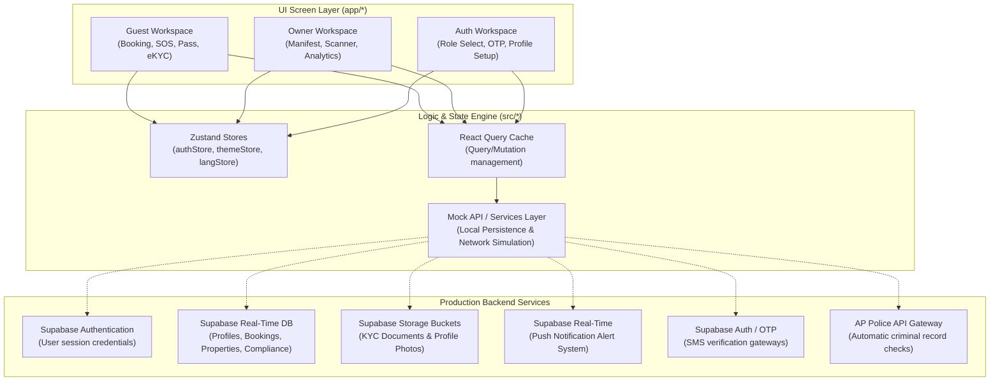

# 🛡️ SafeStay AP Mobile Application

[](https://appolice.gov.in)
[](https://expo.dev)
[](https://reactnative.dev)
[](https://supabase.com)
[](https://github.com/pmndrs/zustand)
[](https://tanstack.com)

SafeStay AP is the official cross-platform mobile application developed in coordination with the **Andhra Pradesh Police Department** to regulate Paying Guest (PG) hostels, co-living spaces, and student accommodations. It features a dual-interface system serving both **Guests** (manifest registry, digital check-ins, eKYC validation, and SOS safety triggers) and **PG Hosts/Owners** (occupant registers, QR code check-in scanners, municipal safety compliance, and property manager stats).

---

## 📖 Table of Contents
1. [System Architecture](#-system-architecture)
2. [Tech Stack Matrix](#-tech-stack-matrix)
3. [Key Features](#-key-features)
4. [App Folder & Routing Map](#-app-folder--routing-map)
5. [Local Development & Setup](#-local-development--setup)
6. [Testing & Mock Scenarios](#-testing--mock-scenarios)
7. [Compliance & Security](#-compliance--security)

---

## 🏗️ System Architecture

The mobile application is architected around a React Native/Expo client that leverages local async engines for development and connects to a backend cluster utilizing Supabase.

### Mobile Client & Backend Integration Flow



---

## 🛠️ Tech Stack Matrix

### 📱 Frontend Mobile Architecture
*   **Core Engine**: React Native 0.81.5 powered by **Expo SDK 54.0.0** (Hermes JS runtime engine)
*   **Coding Standards**: Strict TypeScript templates (`tsconfig.json` configurations)
*   **Routing System**: `expo-router` v6 (File-system routes with typed routing interfaces)
*   **State Store**: `zustand` v5 (Decoupled, hooks-based global state containers)
*   **Server State & Querying**: `@tanstack/react-query` v5 (Query caching, retry states, and optimistic UI mutations)
*   **Form & Verification Layers**: `react-hook-form` paired with `zod` schema verification engines
*   **Native Permissions & Hardware Hooks**:
    *   `expo-camera`: Instant QR scanner integration for host check-in validations
    *   `expo-image-picker`: Profile capture and identification card scanning
    *   `expo-notifications`: Push alerts for co-guest check-in confirmations and active SOS alarms
    *   `expo-secure-store`: Hardware-level keychain credentials encryption (saving API JWTs)
    *   `@react-native-async-storage/async-storage`: Application preferences and workspace caches
*   **Design Language**: Custom vanilla stylesheets leveraging standardized design tokens (`src/constants/theme.ts`) supporting dark mode transitions, `expo-linear-gradient` backdrops, and `expo-blur` glassmorphism.

### 🔌 Backend Cloud Services
*   **Database & Datastore (Supabase)**:
    *   **PostgreSQL Engine**: Relational datastore containing schemas for user profiles, PG accommodations, room configurations, and real-time logs.
    *   **Row-Level Security (RLS)**: Enforces access controls, ensuring hosts can only access listings they own, and guests can only view their active bookings.
    *   **Supabase Storage**: Secure object buckets for document storage (Aadhaar cards, PANs, Passports) with access limits.
    *   **Real-time Subscriptions**: Powers the instant SOS alert pipeline, dispatching real-time updates to hosts when an alarm is triggered.
*   **Push Notifications & Gateway Auth (Supabase)**:
    *   **Supabase Realtime Alerts**: Configured to dispatch low-latency alerts and push events to devices for emergency alarms, guest confirmations, and co-guest requests.
    *   **Supabase OTP Authentication**: Integrates SMS OTP verification for phone confirmation.
*   **AP Police Registry Gateway**:
    *   Automated REST hooks matching incoming profiles against AP Police criminal registries.

---

## 🌟 Key Features

### 🤵 Guest Portal
*   **Seamless eKYC Registry**: Upload identity cards (Aadhaar, PAN, Passport) with OCR-based parameter reading.
*   **Contactless Check-In Pass**: Generates encrypted dynamic check-in QR codes linked to database bookings.
*   **Co-Guest Invitations**: Link travel companions to active bookings. Guests receive invitation requests to sync their profiles before check-in.
*   **Emergency SOS Panel**: Dual trigger modes:
    *   *Audible SOS*: Emits a loud alarm, records current coordinates, and sends alerts to host and local police command.
    *   *Silent SOS*: Discreetly alerts emergency teams with updated location info without displaying active alarm panels on-screen.
*   **Saved Companions List**: Directory for managing frequent travelers' verification documents.

### 🏨 Host & Owner Workspace
*   **Interactive Gate Manifest**: Live registry of current check-ins, upcoming bookings, and checked-out occupants.
*   **Camera QR Scanner**: Validates guests instantly at the property gate by scanning their digital check-in passes.
*   **Watchlist Threat Screening**: Screening engine that cross-references check-ins with AP Police databases. Matches flag profiles and trigger alert notifications.
*   **Compliance Documentation**: Portal for uploading commercial permissions, fire clearance certificates, and CCTV camera online statuses.
*   **Staff Registry Manager**: Management console for host wardens, gatekeepers, and security staff.
*   **Host Business Analytics**: Real-time graphs showing property occupancy rates and revenue metrics.

---

## 📂 App Folder & Routing Map

The application's pages are organized under the `app` folder, using `expo-router` file-system routing conventions:

### 🔑 Authentication Routes (`app/(auth)`)
*   `role-select.tsx` & `role-entry.tsx`: Initial entry points to select between **Guest** or **Owner/Host** panels.
*   `login.tsx`: Phone number entry and gateway triggers.
*   `otp.tsx`: One-time password verification screen.
*   `guest-register.tsx` & `owner-register.tsx`: Profile setup forms requiring name, email, emergency contact details, and compliance items.

### 🤵 Guest Workspace Routes (`app/(guest)`)
*   `home.tsx`: Guest main panel displaying current stay state, active search bar, and emergency widgets.
*   `search.tsx`: Property explorer featuring map view toggles, price limits, and amenity filters.
*   `property/[id].tsx`: Accommodation page showing room capacities, host phone numbers, reviews, and rules.
*   `booking/[id].tsx`: Booking request flow, date configurations, and co-guest invitation tools.
*   `stay.tsx`: Current booking details, room mate indices, check-in timestamps, and check-out triggers.
*   `guest-pass.tsx`: Generates a digital QR check-in pass.
*   `kyc.tsx`: eKYC document upload console.
*   `my-travelers.tsx`: Panel to add companion profiles, upload documents, and pre-verify IDs using OCR simulation.
*   `my-invitations.tsx`: Lists booking requests received from other guests.
*   `emergency-contacts.tsx` & `sos.tsx`: Emergency helpline directories and standard/silent SOS buttons.
*   `profile.tsx` & `edit-profile.tsx`: Guest contact settings.
*   `language.tsx`: System translation switcher (English, Telugu, Hindi).
*   `help.tsx` & `terms.tsx`: User support docs.

### 🏨 Host/Owner Workspace Routes (`app/(owner)`)
*   `dashboard.tsx`: Main dashboard indicating total properties, current occupancy percentage, pending booking approvals, and active alarms.
*   `properties.tsx` & `property/[id].tsx`: Property listing catalog and room inventory manager.
*   `add-property.tsx`: Add a new PG property.
*   `guests.tsx`: Gate check-in database and QR camera scanner.
*   `compliance.tsx`: Document upload form for police clearances, fire permits, and CCTV system statuses.
*   `analytics.tsx`: Financial charts, occupancy metrics, and growth indices.
*   `alerts.tsx` & `alert-settings.tsx`: View active SOS alarms and customize notification targets.
*   `staff.tsx` & `add-staff.tsx`: Staff profiles database.
*   `kyc.tsx` & `bank.tsx`: Business entity registration and host payout setup.
*   `settings.tsx`, `help.tsx`, `support.tsx`, & `terms.tsx`: Owner application configurations.

---

## 🚀 Local Development & Setup

### 1. Installation
Navigate to the mobile application workspace directory and run npm installation:
```bash
# Navigate to workspace
cd SafeStayAP

# Install npm dependencies
npm install
```

### 2. Running Local Dev Server
Start the Expo Metro bundler:
```bash
npx expo start
```

### 3. Launching Simulator/Device
*   **Android Emulator**: Press **`a`** in the terminal runner (requires Android Studio Emulator running).
*   **iOS Simulator**: Press **`i`** in the terminal runner (requires Xcode configured on macOS).
*   **Physical Device (Expo Go)**: Scan the terminal QR code with your mobile camera (iOS) or Expo Go App (Android). Both devices must share the same local network subnet.

### 4. EAS Preview APK Build
To build a preview Android standalone APK:
```bash
npm run build:apk
```

---

## 🧪 Testing & Mock Scenarios

The codebase includes simulated service responses to allow testing of key features without requiring active Supabase network connections.

### 🔑 Demo Logins
*   **Phone Number**: Input any 10-digit number.
*   **OTP**: **`123456`** (Universal login bypass).

### 🚨 Watchlist Threat Alerts
To test the AP Police Watchlist match flagging system:
1.  Navigate to **Guest Panel** -> **My Travelers** or **Co-Guests**.
2.  Add a traveler record using the name containing **`wanted`**, **`criminal`**, **`raju`**, or **`sunder`**.
3.  The local service engine will automatically flag the occupant profile, returning a criminal database match and locking the status to "Flagged".

### 🆘 Emergency Alarm Simulator
1.  Navigate to **Guest Home** -> Tap **SOS**.
2.  Select **Silent SOS** or **Standard SOS**.
3.  The application will update the local alert state. Log in using the **Owner** profile to view the active SOS alert card with corresponding location metadata.

---

## 🛡️ Compliance & Security

*   **Secure Storage**: Uses `expo-secure-store` to write security credentials, utilizing hardware-backed Keychain (iOS) and Keystore (Android) cryptography.
*   **KYC File Privacy**: User document uploads (Aadhaar, PAN, Passport) are stored in secure Supabase Storage buckets with expiration parameters.
*   **Real-time Auditing**: Includes background compliance monitoring to track CCTV camera runtimes, and local security guard registers.
