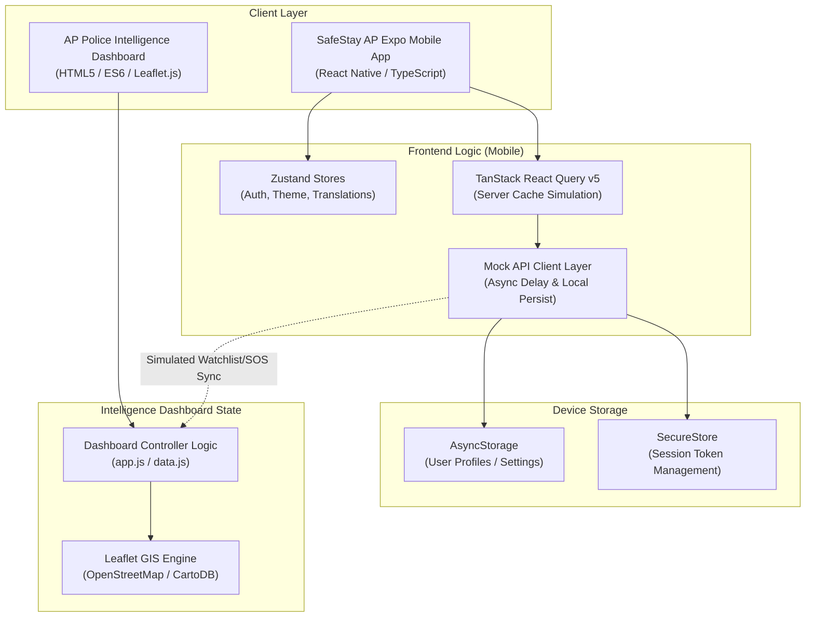
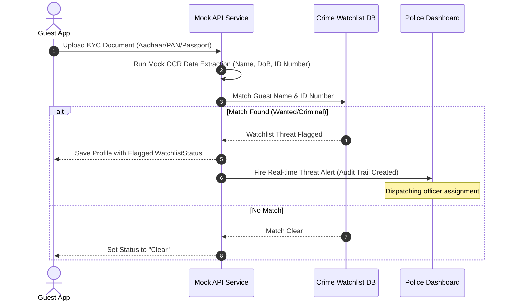
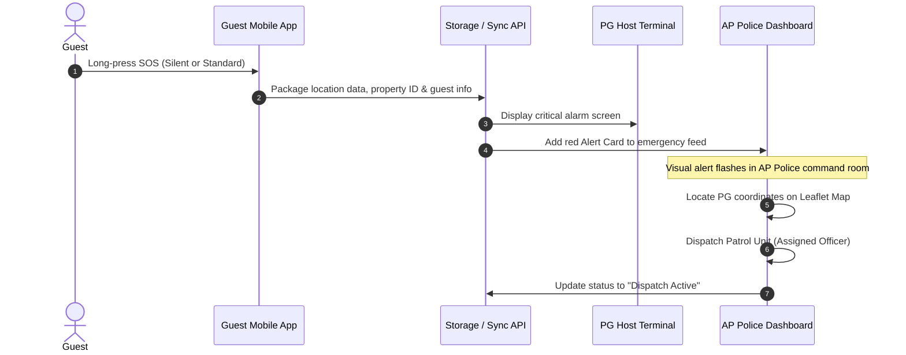

# 🛡️ SafeStay AP — Smart Hospitality & Safety Monitoring

[](https://appolice.gov.in)
[](https://expo.dev)
[](https://reactnative.dev)
[](https://github.com/pmndrs/zustand)
[](https://tanstack.com)
[](https://leafletjs.com)

SafeStay AP is an institutional-grade security and hospitality ecosystem designed in coordination with the **Andhra Pradesh Police Department** to regulate, verify, and monitor Paying Guest (PG) hostels, private accommodations, and temporary rentals. The platform ensures guest safety, automates regulatory compliance, and provides real-time threat detection to help prevent fraud and secure high-occupancy residential locations.

---

## 📖 Table of Contents
1. [Ecosystem Architecture](#-ecosystem-architecture)
2. [Tech Stack Matrix](#-tech-stack-matrix)
3. [Key Features](#-key-features)
4. [System Data Flows](#-system-data-flows)
5. [Codebase & Directory Layout](#-codebase--directory-layout)
6. [Getting Started & Installation](#-getting-started--installation)
7. [Testing & Demo Walkthrough](#-testing--demo-walkthrough)
8. [License & Compliance](#-license--compliance)

---

## 🏗️ Ecosystem Architecture

The SafeStay AP ecosystem is comprised of two core software platforms:
1. **SafeStay AP Mobile App (`SafeStayAP`)**: A cross-platform Expo client serving both **Guests** (eKYC, bookings, silent SOS, and guest passes) and **PG Owners/Hosts** (manifest management, check-in scanning, compliance tracker, and analytics).
2. **AP Police Intelligence Dashboard (`DASHBOARD_AP_POLICE`)**: A GIS-enabled web console for district police command rooms to monitor residential heatmaps, review incident logs, dispatch patrol units, and manage watchlist matches.

### High-Level System Architecture



---

## 🛠️ Tech Stack Matrix

### 📱 SafeStay AP Mobile App
*   **Core Framework**: React Native 0.81.5 with **Expo SDK 54.0.0**
*   **Programming Language**: TypeScript (with strict typing)
*   **Routing System**: `expo-router` v6 (File-based routing with support for Typed Routes)
*   **State Management**: `zustand` v5 (Lightweight decoupled hooks for reactive stores)
*   **Network/Data Fetching**: `@tanstack/react-query` v5 (Queries, Mutations, Cache-invalidation)
*   **Form Management**: `react-hook-form` & `zod` schema-based validation
*   **Hardware / Native API Integrations**:
    *   `expo-camera`: Direct QR scanner utility & document capturing
    *   `expo-image-picker`: Profile photo selection & document uploads
    *   `expo-notifications`: Push alert delivery
    *   `expo-secure-store`: Hardened encryption storage for authentication tokens
    *   `@react-native-async-storage/async-storage`: Application preferences and cached data
*   **Animations & UI Styling**:
    *   `react-native-reanimated` v4: For hardware-accelerated layouts
    *   `expo-linear-gradient`: Premium visual backdrops
    *   `expo-blur`: Glassmorphic tabs and panels
    *   Vanilla `StyleSheet` styling leveraging pre-defined color constants (`src/constants/theme.ts`)
*   **Internationalization**: Custom `i18n` translation layer supporting English, Telugu (తెలుగు), and Hindi (हिन्दी)

### 🚔 AP Police Intelligence Web Dashboard
*   **User Interface**: Custom HTML5/CSS3 styled with custom CSS variables (Supporting native Light/Dark themes)
*   **Geospatial Tracking**: **Leaflet.js** using CartoDB Dark Matter (Dark Theme) and CartoDB Voyager (Light Theme) tile streams
*   **Application Logic**: Vanilla ES6 JavaScript (handling real-time search filtering, drawer analytics, and incident handling)
*   **Hosting Configuration**: Deployable statically on Vercel (`vercel.json` routes pre-configured)

---

## 🌟 Key Features

### 🤵 Guest Portal
*   **Unified eKYC System**: Upload identity cards (Aadhaar, PAN, Passport) with custom mock-OCR metadata extraction.
*   **Guest Digital ID Pass**: Generates dynamic QR codes linked to verified bookings for zero-contact check-in at PG gates.
*   **Co-Guest Invites**: Add travel companions to bookings. Companions receive invite alerts and must verify their profiles before checking in.
*   **SOS Panic Dashboard**: Allows instant activation of standard (audible) or silent emergency alarms. Automatically resolves location-coordinates and notifies both PG hosts and local police divisions.
*   **Saved Travelers Directory**: Store verified companion profiles for quick reference during booking.

### 🏨 PG Owner Panel
*   **Digital Gate Registry**: Live check-in list of current occupants. Hosts can check-in guests by scanning their QR code.
*   **Automated Watchlist Check**: Performs immediate screening of all incoming guest names and IDs against active criminal watchlists. Flagged entries prompt warnings on both the host's phone and the police dashboard.
*   **Compliance Control Center**: Document uploads for business licenses, police clearance certificates, CCTV health statuses, and fire safety ratings.
*   **Analytics Dashboard**: Occupancy trends, monthly revenue indicators, and growth trackers.
*   **Staff Registry**: Management panel for wardens, security, and cleaning crews.

### 👮 AP Police Command Dashboard
*   **Interactive District Map**: Geospatial representation of Andhra Pradesh PG Hubs (Vijayawada, Visakhapatnam, Guntur, Tirupati, Kurnool, Anantapur) indicating occupancy density, SOS alarms, and threat matches.
*   **Live Audit Scores**: Track compliance audits of local hostels. Features a "Force Audit" trigger to inspect digital registers remotely.
*   **Active Emergency Feed**: Instant alarm ticker detailing the threat level, property location, and timestamp of any guest SOS activation.
*   **Incident Dispatch Console**: Assign police officers to investigate alarms, update cases, and resolve threats directly.

---

## 🔄 System Data Flows

### 1. eKYC Verification & Criminal Watchlist Screening



### 2. Emergency SOS / Silent Alarm Flow



---

## 📂 Codebase & Directory Layout

### 1. `SafeStayAP` (Mobile Frontend Workspace)
```
SafeStayAP/
├── .expo/                   # Local Expo compilation cache
├── app/                     # file-based route mapping (expo-router)
│   ├── (auth)/              # Authentication flow screens
│   │   ├── guest-register.tsx
│   │   ├── owner-register.tsx
│   │   ├── login.tsx
│   │   ├── otp.tsx
│   │   ├── role-entry.tsx
│   │   └── role-select.tsx
│   ├── (guest)/             # Verified Guest Portal screens
│   │   ├── booking/         # Dynamic booking screens
│   │   ├── property/        # Property profiles & details
│   │   ├── home.tsx         # Guest Dashboard
│   │   ├── guest-pass.tsx   # QR Check-in Pass
│   │   ├── kyc.tsx          # eKYC upload manager
│   │   ├── sos.tsx          # Silent/Panic SOS dashboard
│   │   └── stay.tsx         # Current booking stay tracker
│   ├── (owner)/             # Property Host Portal screens
│   │   ├── dashboard.tsx    # Owner's stats dashboard
│   │   ├── guests.tsx       # Gate manifest, check-in scanner
│   │   ├── compliance.tsx   # Police certificate uploads
│   │   └── analytics.tsx    # occupancy / revenue trend charts
│   ├── _layout.tsx          # Application navigation state router
│   ├── onboarding.tsx       # Onboarding screen
│   └── index.tsx            # Initial entry hub
├── assets/                  # App icon, splash screen images
├── src/                     # Core Business Logic & Shared Assets
│   ├── components/
│   │   ├── property/        # PropertyCard.tsx components
│   │   └── ui/              # Atom components (Buttons, Inputs, Cards)
│   ├── constants/
│   │   └── theme.ts         # Color palette, shadows, borders
│   ├── data/                # Seed mock databases (properties, bookings, users)
│   ├── i18n/
│   │   └── translations.ts  # English, Telugu, Hindi copy maps
│   ├── services/
│   │   ├── mockApi.ts       # Simulated network request latencies
│   │   └── storage.ts       # AsyncStorage and SecureStore layers
│   ├── store/
│   │   ├── authStore.ts     # Global auth states
│   │   ├── langStore.ts     # Language selection store
│   │   └── themeStore.ts    # Application visual theme state
│   └── types/
│       └── index.ts         # System TypeScript models
├── app.json                 # Expo configuration manifest
├── babel.config.js          # Babel presets
├── package.json             # NPM dependencies
└── tsconfig.json            # Compiler settings
```

### 2. `DASHBOARD_AP_POLICE` (Police Intel Workspace)
```
DASHBOARD_AP_POLICE/
├── index.html               # Main command room markup
├── style.css                # Visual aesthetics, light/dark themes
├── app.js                   # Map initialization & event logic
├── data.js                  # Simulated database for AP districts
└── vercel.json              # Vercel deployment routes config
```

---

## 🚀 Getting Started & Installation

### Prerequisite Environment
To run these workspaces locally, make sure you have:
*   [Node.js](https://nodejs.org/) (Version v18 or later recommended)
*   [Git](https://git-scm.com/)

---

### Running the Mobile Client (`SafeStayAP`)

1.  **Navigate to the mobile directory**:
    ```bash
    cd SafeStayAP
    ```

2.  **Install dependencies**:
    ```bash
    npm install
    ```

3.  **Start the Expo bundler**:
    ```bash
    npx expo start
    ```

4.  **Launch the simulator or scan the QR**:
    *   Press **`a`** for Android Emulator (requires Android Studio configuration).
    *   Press **`i`** for iOS Simulator (requires Xcode on macOS).
    *   Scan the terminal QR code using the **Expo Go** application on an Android or iOS device (ensure your computer and mobile device are connected to the same local network subnet).

5.  **Compile Preview Builds (EAS)**:
    To compile a preview APK for testing on Android:
    ```bash
    npm run build:apk
    ```

---

### Running the AP Police Intelligence Dashboard (`DASHBOARD_AP_POLICE`)

The dashboard is built using standard web technologies. It can be opened directly in your web browser or hosted locally.

1.  **Direct Browser Access**:
    Open the file `D:\AP PG POLICE PROJECT\SOFTWARE\AP_PG_V1_PROJECT\DASHBOARD_AP_POLICE\index.html` directly in Google Chrome, Microsoft Edge, or Firefox.

2.  **Using a Local Static Server** (Recommended for maps):
    If you have `npx` installed:
    ```bash
    cd DASHBOARD_AP_POLICE
    npx serve .
    ```
    Alternatively, if you use Visual Studio Code, right-click `index.html` and select **Open with Live Server**.

---

## 🧪 Testing & Demo Walkthrough

The SafeStay AP environment includes built-in mock configurations to allow full end-to-end flows.

### 🔐 Simulated Credentials
*   **Phone Number**: Any valid 10-digit number.
*   **OTP**: **`123456`** (Universal login bypass).

### 👥 Multi-Role Testing Scenario
1.  **Login as Guest**:
    *   On the onboarding page, select the **Guest** role.
    *   Enter a phone number, use the OTP `123456`, and complete registration.
    *   Explore the dashboard, select **eKYC**, and submit a document upload.
    *   Browse verified PG properties, select a room, and initiate a Booking.
    *   Navigate to **Guest Pass** to view the generated QR Code.

2.  **Login as Host/Owner**:
    *   Open another instance or log out, then choose the **Owner** role.
    *   Log in using the owner role setup.
    *   Access the **Guests** tab, view your check-ins, or simulate a scanner check-in.
    *   Review the **Compliance** tab to view local municipal safety permits.

3.  **Simulate Watchlist Threat Triggers**:
    *   In the Guest App under **Saved Travelers** or **Co-Guests**, attempt to save or check-in a traveler with a name containing **`wanted`**, **`criminal`**, **`raju`**, or **`sunder`**.
    *   The system will automatically flag the profile, showing: `Flagged in AP Crime Watchlist: Active warrant outstanding for Section 420 IPC`.
    *   Open the **AP Police Intelligence Dashboard** to view the live threat alert appearing on the command screen.

4.  **Simulate SOS Incident Dispatch**:
    *   In the Guest App, tap the **SOS** button on the home screen.
    *   Choose to trigger a Standard or Silent SOS.
    *   The Police Web Dashboard will instantly trigger an audible alarm, displaying a critical alert card in the left column.
    *   Click the card on the police dashboard to pinpoint the PG hostel location on the map, assign an officer, and update the status to "Resolved".

---

## 📜 License & Compliance

SafeStay AP is proprietary software developed in coordination with the Andhra Pradesh Police Department. 
*   **Software Licensing**: MIT License
*   **Information Security Standards**: Complies with Aadhaar eKYC storage regulations (no physical logs are stored unencrypted). All sensitive authentication keys utilize Android Keystore / iOS Keychain APIs via `expo-secure-store`.
